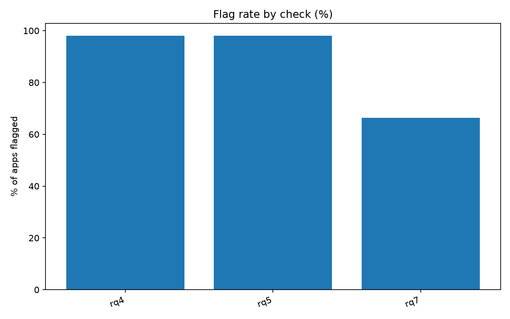
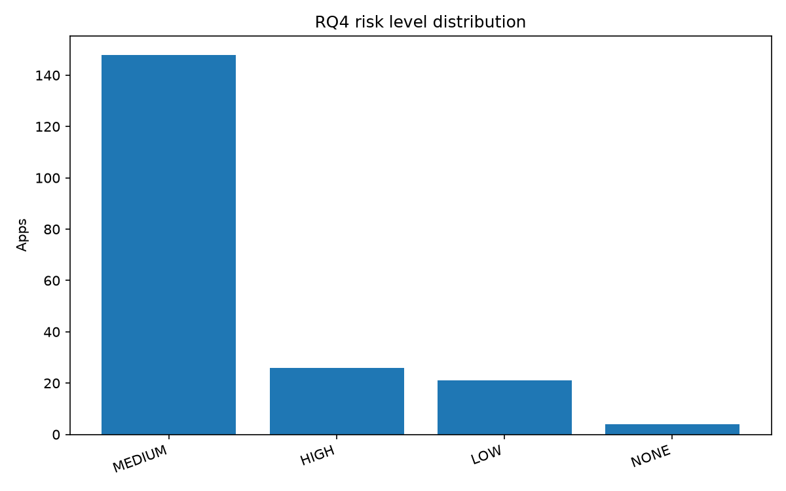
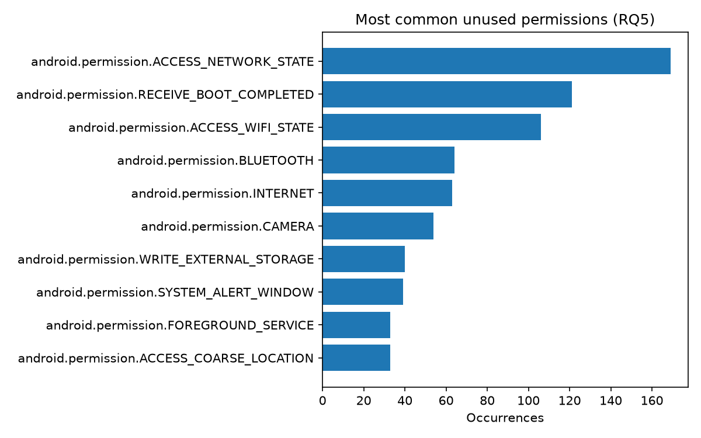
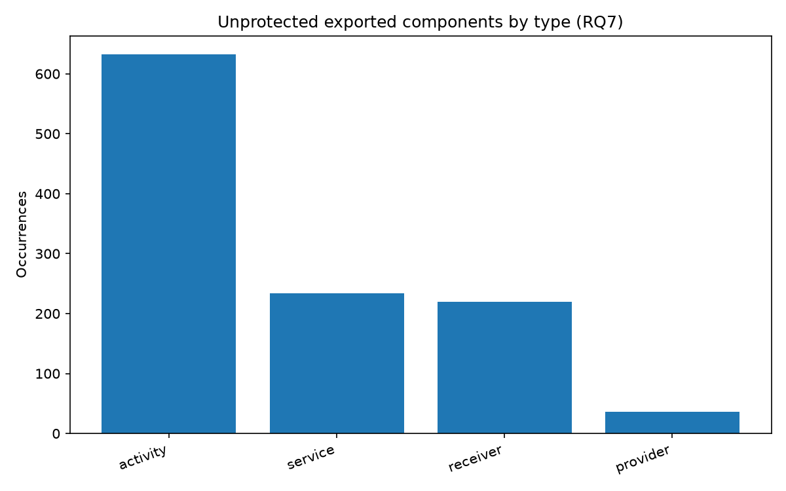
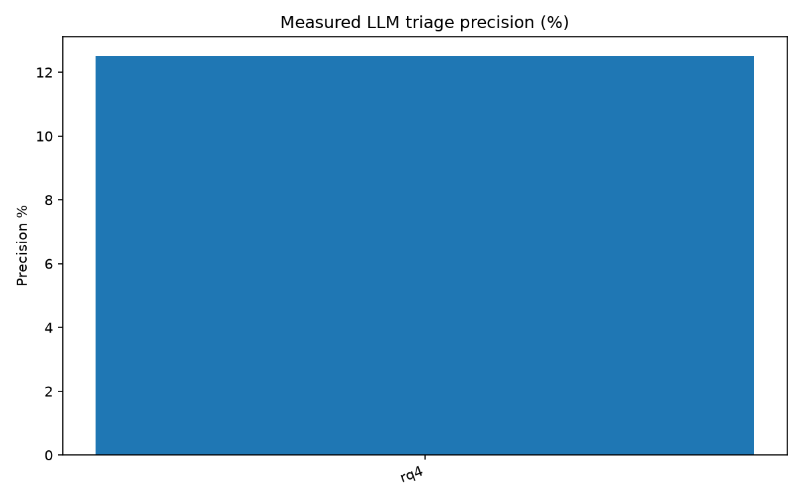

# Analysis summary

## Flag rate by check

| rq   | label                                 |   flagged |   total |   flag_rate_pct |
|:-----|:--------------------------------------|----------:|--------:|----------------:|
| rq4  | RQ4 — Internet + PII Permissions      |       195 |     199 |            98   |
| rq5  | RQ5 — Unused Permissions              |       195 |     199 |            98   |
| rq7  | RQ7 — Unprotected Exported Components |       132 |     199 |            66.3 |

## RQ4 risk level distribution

| risk_level   |   n |
|:-------------|----:|
| MEDIUM       | 148 |
| HIGH         |  26 |
| LOW          |  21 |
| NONE         |   4 |

## Most common unused permissions (RQ5)

| permission                                |   n |
|:------------------------------------------|----:|
| android.permission.ACCESS_NETWORK_STATE   | 169 |
| android.permission.RECEIVE_BOOT_COMPLETED | 121 |
| android.permission.ACCESS_WIFI_STATE      | 106 |
| android.permission.BLUETOOTH              |  64 |
| android.permission.INTERNET               |  63 |
| android.permission.CAMERA                 |  54 |
| android.permission.WRITE_EXTERNAL_STORAGE |  40 |
| android.permission.SYSTEM_ALERT_WINDOW    |  39 |
| android.permission.FOREGROUND_SERVICE     |  33 |
| android.permission.ACCESS_COARSE_LOCATION |  33 |

## Unprotected exported components by type (RQ7)

| component_type   |   n |
|:-----------------|----:|
| activity         | 632 |
| service          | 234 |
| receiver         | 220 |
| provider         |  36 |

## Apps with the most findings

| app_name                                                       |   rq5_unused |   rq7_vulnerable |   total_findings |
|:---------------------------------------------------------------|-------------:|-----------------:|-----------------:|
| fitpro_2.1.0_Apkpure                                           |            6 |              134 |              140 |
| Notify for Mi Band_15.4.5_Apkpure                              |           18 |               85 |              103 |
| Notify for Amazfit & Zepp_15.3.6_Apkpure                       |           18 |               76 |               94 |
| com.blossomsazz.app_1                                          |           10 |               58 |               68 |
| Amazon Alexa_2.2.486074.0_Apkpure                              |           10 |               44 |               54 |
| Lovense Remote_5.7.4_Apkpure                                   |           11 |               40 |               51 |
| Copy of com.asis.petechmobil_19                                |            5 |               34 |               39 |
| Copy of com.bdcricketlivescore.bangladeshcricketlivematchhd_16 |            4 |               30 |               34 |
| Copy of com.bmw.ConnectedRide_551010                           |           20 |               14 |               34 |
| MIFON_ Award Winning Phone Anti Theft Protection_12.70_Apkpure |            7 |               26 |               33 |

## Measured triage precision

| rq   | label                            |   tp |   fp |   triaged |   precision_pct |
|:-----|:---------------------------------|-----:|-----:|----------:|----------------:|
| rq4  | RQ4 — Internet + PII Permissions |    1 |    7 |         8 |            12.5 |

